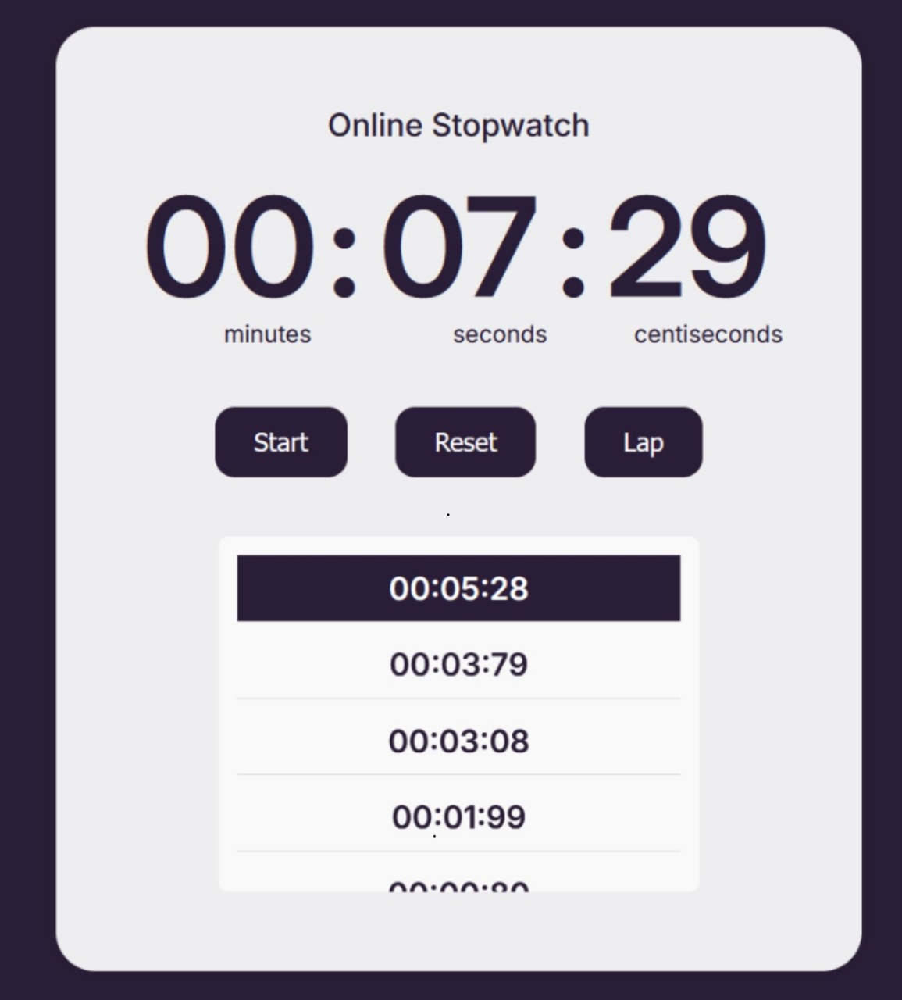

# Stopwatch Tech Challenge ⏱️

Welcome to the **Stopwatch Tech Challenge** for AkSub **FAVE**! This is a simple and interactive web-based stopwatch that allows you to track time with features like start, pause, reset, and lap times. Built using pure **HTML**, **CSS**, and **JavaScript**, this stopwatch can be used for various activities requiring precise time tracking.

<br>

## 🚀 Live Demo

Check out the live version of the stopwatch:  
[https://stopwatch-kez.vercel.app/](https://stopwatch-kez.vercel.app/).

## 🛠️ Features

- **Start/Pause**: Easily start and pause the stopwatch with a single button.
- **Reset**: Reset the stopwatch to zero for a fresh start.
- **Lap Feature**: Track lap times with a separate display of recorded laps.
- **Simple Interface**: A clean and minimal design for ease of use.
- **Accurate Time**: The stopwatch tracks time accurately in seconds and centiseconds.

## 💻 Technologies Used

- **Frontend**: HTML, CSS, JavaScript
- **Hosting**: Vercel

## 🎯 How to Use

1. Visit the [live demo](https://stopwatch-kez.vercel.app/).
2. Click the **Start** button to begin timing.
3. To pause the stopwatch, click the **Pause** button.
4. To reset the stopwatch back to zero, click the **Reset** button.
5. To record a lap, click the **Lap** button. Each lap time will be shown below the main time display.
6. The time will continue to update in real-time, showing minutes, seconds, and centiseconds.

## 📸 Screenshots



## 🔧 Installation

If you want to run this project locally, follow these steps:

1. Clone the repository:
   ```bash
   git clone https://github.com/Kezota/Kezia_TechChallenge_Stopwatch_01.git
   ```
2. Navigate to the project directory:
   ```bash
   cd Kezia_TechChallenge_Stopwatch_01
   ```
3. Open `index.html` in your browser to view the stopwatch. Or open with Live Server.

## 👏 Credits

This project was built as part of a tech challenge.

## 🤝 Contributing

If you'd like to contribute to the development of this project, feel free to fork the repository and submit a pull request. Contributions are always welcome!
